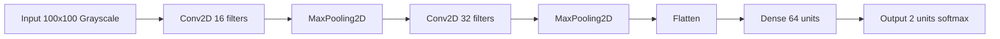

# 🧠 CNN Learning Lab

**An interactive educational tool that lets you teach a convolutional neural network (CNN) to recognize objects using your webcam!**

## 🌟 Overview

CNN Learning Lab is an interactive educational application that allows you to:
- Capture images of two different objects using your webcam
- Train a convolutional neural network (CNN) entirely in your browser
- See real-time classification results
- Visualize what the CNN "sees" through feature maps and activations
- Understand how machine learning models learn from visual data

**All processing happens locally in your browser - no server required!**

## 🚀 How It Works

1. **Capture Samples**: Take photos of two different objects
2. **Train Model**: Build and train a CNN in your browser
3. **Classify**: See real-time predictions on new images
4. **Visualize**: Explore feature maps and activations

## 🖥️ User Interface

### Main Components:
1. **Webcam Feed**: Real-time camera view
2. **Capture Controls**: Buttons to capture Object 1 and Object 2
3. **Training Controls**: Train Model and Reset buttons
4. **Status Panel**: Shows current status and sample counts
5. **Results Section**: Classification output and confidence
6. **Visualizations**: Feature maps and activation visualizations
7. **Instructions**: Step-by-step usage guide

## 🧪 Educational Value

This project demonstrates:
- How CNNs learn visual features from images
- The importance of training data variety
- How convolutional layers detect patterns
- The role of activation functions
- Model training and evaluation metrics

Perfect for students learning about:
- Computer vision fundamentals
- Neural network architectures
- Machine learning workflows
- Model interpretability

## 🛠️ Technical Implementation

### Tech Stack
- **Frontend**: Pure HTML/CSS/JavaScript
- **Machine Learning**: TensorFlow.js
- **Computer Vision**: Webcam API + Canvas API
- **Hosting**: Hugging Face Spaces (Static)

### Model Architecture

### Training Parameters
- **Epochs**: 15
- **Batch size**: 8
- **Optimizer**: Adam
- **Loss**: categorical crossentropy

### Running Locally
Open `index.html` in a modern browser and allow webcam access. No server
setup is required.

### Deploying to Cloudflare Pages
1. Create a new **Pages** project in your Cloudflare dashboard.
2. Connect this repository and leave the build settings empty (it's a static site).
3. Start the deployment and your app will be live once the build finishes.

## License
This project is released under the CC0 license. See [LICENSE](LICENSE) for details.
